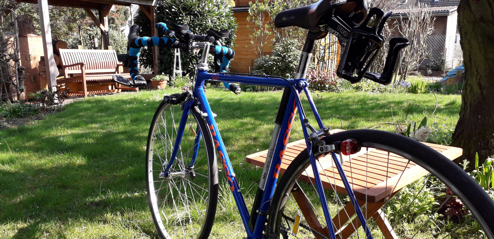
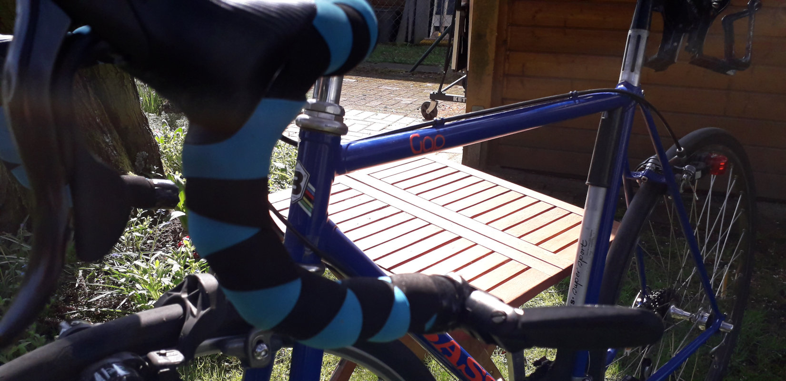

# Travelling with a towel...
and a bit more. Obviously a towel would be enough, but I do like to travel with a few more items.
This is not a comprehensive list, nor advertisement. These are just some pieces you 
might be interested in. Feel free to ask any questions, add your recommendations or share your experiences
down below.

# Das Reisehandtuch...
und ein paar weitere nützliche Begleiter. Selbstverständlich wäre ein Handtuch 
vollkommen ausreichen, ich bevorzuge jedoch das Eine oder Andere mitzunehmen.
Dies ist weder eine vollständige Auflistung, noch Werbung, sonder einfach ein paar
interessante Reisebegleiter. Ich freue mich über Fragen, Empfehlungen oder eure Erfahrungen in
den Kommentaren. 

---

## The two wheeled, human muscle-powered mode of transportation
 
or bike for short. The careful observer will notice, that this is not the bike
I took on my first tour. Back then I used a special travel-bike from **Gudereit**.
Sturdy, reliable and great disc brakes, but **heavy!!**.
I have bin riding my roadbike before that already and since that tour I'm certain 
I want to do the next tours on my roadbike. This actually is the first bike my dad built 
more than 35 years ago. I love this **Basso Gap**. There are a few changes. Mainly the frame is
powder-coated and has new logos.
For safety, the shifters were upgraded to combination brake-shift levers, so my hands don't have to leave
the breaks, when shifting. The aero or time trial handle bars give me a great alternative position to ride
in. 
So this bike is no longer a beautiful _retro_ bike, it's not a fast nor light bike compared to modern 
carbon frames, but none the less I **love** to ride this beauty.

## Das zweirädrige, muskelkraftbetriebene Fortbewegungsmittel der Wahl
oder kurz Fahrrad. Den Aufmerksamen wird aufgefallen sein, dass dies nicht das Rad
meiner ersten Tour ist. Damals hatte ich ein extra Reiserad der Bielefelder Marke **Gudereit**
(Grüße nach Bielefeld). Sehr stabil, zuverlässig und mit wunderbaren Scheibenbremsen, aber
**schwer** wie ein Schiffsanker.
Nach der Tour habe ich entschieden, die nächsten Touren auf meinem Rennrad zu fahren.
Allerdings nicht auf irgend einem Rennrad, sonder auf dem ersten selbst gebauten Rennrad meines Vaters.
Ein wunderschönes **Basso Gap**. 
Verändert hat sich vor allem die Farbe, es ist Pulver beschichtet und hat neue Logos.
Aus Sicherheitsaspekten habe ich die Schaltheber auf kombi Brems-Schalthebel umgerüstet. Somit muss meine
Hand zum Schalten nicht mehr den Bremshebel verlassen. Der aero oder zeitfahr Lenkeraufsatz ermöglicht eine
alternative, aerodynamische Fahrposition.
Es ist kein originaler Oldtimer mehr, es ist, im Vergleich zu modernen Carbonrädern, langsam und schwer,
und gerade trotzdem **liebe** ich es mit dieser Schönheit unterwegs zu sein.

---
## There is more...
there are a few more parts I want to write about. So stay tuned!

## Es gibt noch mehr....
Da sind noch mehr Details, über welche ich schreiben möchte. Bleibt gespannt und schaut von Zeit zu Zeit mal rein!

